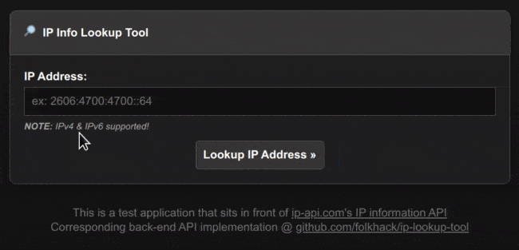

# IP Lookup Tool Front-end

This project is a proof-of-concept for a good-practices Typescript React application built with esbuild. It is a fully functional IP address validation and lookup tool that uses [ip-api.com](https://ip-api.com) to query information about the supplied address.



Corresponding back-end application at: https://github.com/folkhack/ip-lookup-tool

### PUNCH:

* Update this project, re-build git and submit to github

##### Application Features:

* Responsive minimalistic web application for looking up IP address info
* IPv4 and IPv6 lookup support
* Input validation, error handling

##### Development Features:

* React based SPA (single-page application) - [`src/index.tsx`](src/index.tsx)
* esbuild based build system - [`build.js`](build.js)
    - Devevelopment/production builds with minification etc.
    - Watched assets/src with live reload
    - Bundle analyze tool
* Linux, Mac, Windows support
* Node.js LTS
* ECMAScript 2015 Module Imports
* TypeScript - [`tsconfig.json`](./tsconfig.json)
* eslint (linting) - [`.eslintrc.json`](./.eslintrc.json)
* Jest (testing) - `npm run tests`; [`jest.config.js`](./jest.config.js)
    - Unit testing - `npm run tests`; [`src/**/*.test.ts`](./src)
    - Integration testing - `npm run tests`; [`src/**/*.test.ts`](./src)
    - Code coverage at 100% - `npm run coverage`
    - Snapshot testing - `npm run tests src/App`
    - Accessibility testing - `npm run tests`
* Playwright (testing) - `npm run tests_e2e`; [`tests/e2e/**/*.spec.ts`](tests/e2e)
* Sublime 4 workflow (linting, TypeScript support w/LSP, Linux/Mac/Windows support) - [`*.sublime-project`](ip_lookup_tool_frontend.sublime-project)

---

## Usage:

**NOTE:** Expects [ip-lookup-tool HTTP API](https://github.com/folkhack/ip-lookup-tool) to be running.

##### Building:

```bash
# FOR DEVELOPMENT:

# Build production application
npm run build

# Build production application and serve
npm run serve

# Build production application and analyze bundle
npm run build_analyze

#############################################################################################

# FOR PRODUCTION:

# Build development application (enables additional debugging/dev features)
npm run build_dev

# Build development application and serve
npm run serve_dev

# Watch assets/src directories, build on changes, and serve
npm run build_watch

# Watch assets/src directories, build on changes, serve, and live reload the browser
npm run build_reload
```

You can control the build script even more (ex: setting logging levels, serve ports) - see [docs/esbuild_build_script.md](../docs/esbuild_build_script.md) for more complex build options/information!

##### Linting

```bash
# Lint the project assets and report on code consistency issues
npm run lint

# Fix the linting errors produced
# - IMPORTANT - This will edit your code!
npm run lint_fix
```

##### Tests


```bash
# Run application unit, integration, snapshot, and accessibility tests
npm run tests
npm run tests_verbose

# Run tests from `npm run tests` above and also generate code coverage report
npm run coverage
npm run coverage_verbose

# Run Playwright E2E tests
npx playwright install # only needs to be done once!
npm run tests_e2e
```

---

### Project Parts:

* [Node.js/base setup](docs/node.md) - Base nvm/Node.js installation, module imports, `package.json` setup
* [TypeScript](docs/typescript.md) - strongly typed programming language built on JavaScript
* [esbuild `build.js`](docs/esbuild_build_script.md) - Main application build script
* [React](docs/react.md) - React application details/anatomy
* [Jest](docs/jest.md) - Unit and integration testing, code coverage
* [Playwright](docs/playwright.md) - E2E testing through the Playwright library
* [eslint](docs/eslint.md) - linting, code formatting
* [DevTools Tooling](docs/devtools.md) - Tools/dev features available in Chrome/Chromium DevTools
* [Image Optimization](docs/image_optimization.md) - Using optimizt to optimize static image assets
* [Sublime Text 4](docs/sublime_text.md) - Project config designed to use TypeScript language server and eslint linting
* [README Demo GIF](docs/demo_gif.md) - Creating a demo GIF for use on your README.md

---

### Modifying to Taste:

This is an optional list to help you get started modifying this project a sane starting-point for another project. This is not a definitive list and avoids documenting obvious things like dependencies.

* Project name:
    - Rename `*.sublime-project` to `project_name.sublime-project`
    - Set `name` in [`package.json`](/package.json)
    - Search for "ip_lookup_tool_frontend" in the docs:
        + `README.md` (this file)
* ECMA version:
    - [`tsconfig.json`](/tsconfig.json)
        + `compilerOptions.target`
        + `compilerOptions.module`
    - [`.eslintrc.json`](/.eslintrc.json)
        + `env.es6` for modern ECMA features
        + `parserOptions.ecmaVersion`
* Module support:
    - [`package.json`](/package.json)
        + `type` (remove if CJS desired)
    - [`tsconfig.json`](/tsconfig.json)
        + `compilerOptions.moduleResolution`
        + `compilerOptions.module`
    - [`.eslintrc.json`](/.eslintrc.json)
        + `env.es6` for modern ECMA features
        + `parserOptions.sourceType`
    - [`jest.config.js`](/jest.config.js)
        + `preset`
        + `extensionsToTreatAsEsm`
        + `transform` (modify/remove `useEsm` transforms)
        + Modify/remove `transform_node_modules` in [`jest.config.js`](jest.config.js)
        + Modify/remove `JestSetup.fix_exported_modules_w_named_defaults` in [`jest_setup.js`](jest_setup.js)
* Node.js support:
    - [`tsconfig.json`](/tsconfig.json)
        + `compilerOptions.moduleResolution`
    - [`.eslintrc.json`](/.eslintrc.json)
        + `env.node`
* TypeScript support:
    - [`.eslintrc.json`](/.eslintrc.json)
        + `parser`
        + `extends` - `@typescript-eslint/recommended`
        + `plugins` - `@typescript-eslint`
        + Modify/remove TypeScript-specific rules
        + Modify/remove `compilerOptions.paths` path aliases
* esbuild support:
    - Modify esbuild build script options/tooling
        + ex: Change `dist` directory, add/edit entry points
        + Most likely don't need to edit this - most applicable options available to be configured through CLI arguments
* Browser support:
    - [`tsconfig.json`](/tsconfig.json)
        + `compilerOptions.moduleResolution`
    - [`.eslintrc.json`](/.eslintrc.json)
        + `env.browser`
        + Modify/remove Browser-specific rules
    - [`jest.config.js`](/jest.config.js)
        + `testEnvironment`
* Jest support:
    - [`.eslintrc.json`](/.eslintrc.json)
        + `env.jest`
        + `plugins` - `jest`
        + Modify/remove Jest-specific rules
        + Modify/remove `moduleNameMapper` path aliases (will match aliases in `tsconfig.json`)
